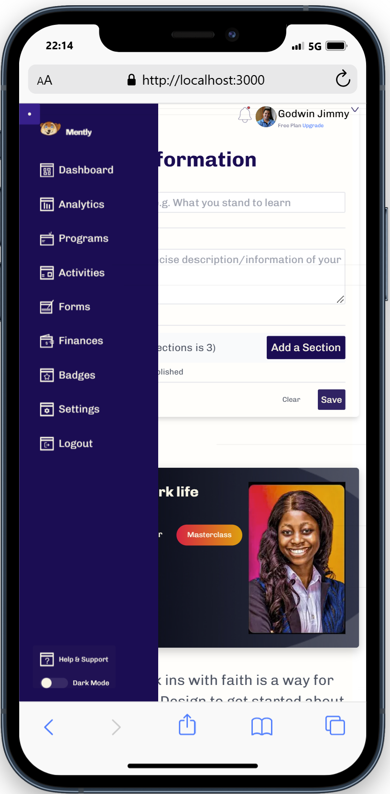

Mently Project - Design Transformation

## Screenshots

Introduction
This project was aimed at transforming the given design for Mently into a more polished, industry-standard product. The objective was to enhance visual balance, improve usability, and create a design that resonates with Mently’s brand identity while maintaining a clean, modern, and engaging user interface.

Key Enhancements
1. Custom Icons for a Stronger Brand Identity
Designed and integrated custom icons that are unique to the Mently brand.
Ensured the icons align with the overall theme and add personality to the design.
Focused on maintaining consistency in style, size, and color to achieve visual harmony.

2. Color Adjustment & Contrast Balancing
Reviewed the initial color palette and adjusted all colors for improved balance and visual hierarchy.
Enhanced contrast to ensure readability and better accessibility.
Applied a cohesive color scheme to provide a more unified brand experience.

3. Micro-Animations for a Smooth User Experience
Added clean micro-animations to key elements to improve interactivity and user engagement.
Kept animations subtle and performance-friendly, ensuring they enhance rather than distract from the content.
Applied transition effects for buttons, icons, and navigation elements to give the interface a modern touch.

4. Structural & Visual Improvements
Focused on creating a well-structured layout that provides clarity and ease of navigation.
Improved spacing, typography, and component alignment for a cleaner, more organized design.
Ensured the interface is responsive and looks great across various screen sizes, including desktop and mobile.

5. Eye-Catching and User-Friendly Design
Delivered a visually appealing and functional design that draws attention without compromising usability.
Prioritized simplicity and functionality while incorporating modern design trends.

Conclusion
The Mently project was transformed into an industry-standard design by focusing on brand consistency, accessibility, and modern UI/UX principles. With custom icons, balanced colors, clean animations, and thoughtful structure, the final result is a polished and engaging experience that reflects Mently’s identity and vision.